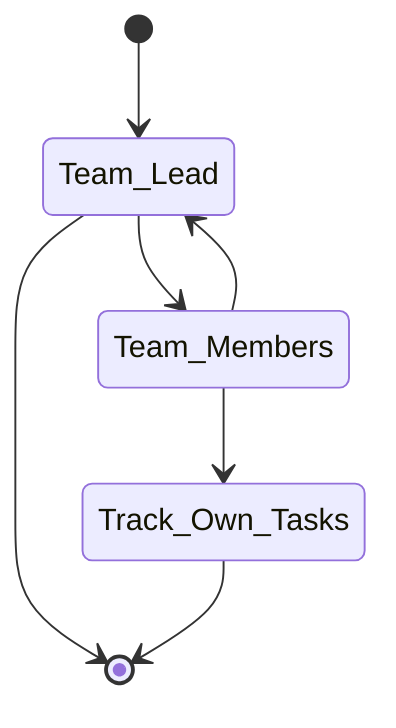

# EGL314-TeamA-ProjectSpace
*Scrum link : https://docs.google.com/spreadsheets/d/1K91aIip-ZL4T0M8RgZgr2uuCa6e8iVZyCFgKndAOjxg/edit?usp=sharing*

*Slides link : https://docs.google.com/presentation/d/1gpmwZyzl72j914PGxcWpIQM8QkVoPqJsxVBmEhtlBfE/edit
## Team composition and roles
Team Lead : Yi Shan
Asst Team Lead : Choon Kee
Video : Yi Mon
Programming : Thinesh & Aloysius
## Storyboard

## Floor Plan


## System Diagrams 

## Research 

## Codes
```
This is a sample code block

```
## Game Ideas
*Reference link :https://www.youtube.com/watch?v=3QKiK4rJIB0*


## Video Ideas



