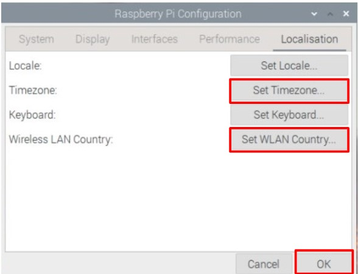
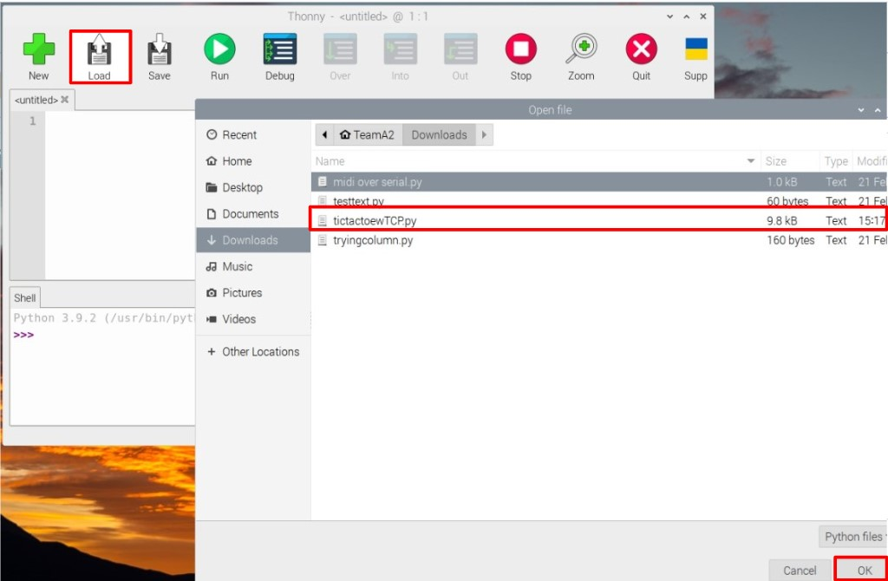

# EGL314-TeamA-ProjectSpace                 
# Bill Of Material (BOM)

 1. 1x Novation Launchpad Mk2
 2. 2x Raspberry Pi Raspi 4 Model B
 3. 1x Short Throw Projector Sony VPL-SW630
 4. 1x Media Server Lenovo ThinkStation P920
 5. 2x Ceiling Speakers Extron FF 220T
 6. 1x OEM Screen
 7. 1x Audio Amplifier Extron XPA 1002
 8. 1x Laptop HP Zbook 15 G5
 9. 1x HDMI Extender TX Kramer PT-571
 10. 1x HDMI Extender RX Kramer PT-572+
 11. 1x Wireless Router Netgear
 12. 1x LED Strips
 13. 1x Artnet/DMX Node 1 Eurolite
 14. 1x FTP3 RGB LED DMX Driver

 # Required Software and Licenses

 1. Christie Pandora Box
 2. Widget Designer
 3. Server Manager 
 4. Thonny Python IDE
 5. Dongles for Pandora license

 # Network Settings


Login to router
</br>
username: admin
</br>
Login to router by going to a web browser and entering address 192.168.1.1 under URL section, then sign in with:\
username: admin\
password: password

Name: TeamA
</br>
Password: mtswifipwd

Router IP address set to 192.168.10.1

 # How To Start
## Video Hardware Setup

The video setup for our project consists of a ultra-short throw projector mounted onto a truss, then secured with a safety cable.

The projector is shooting to a OEM Screen, which is placed on the floor.

Video is sent to the projector via HDMI Extender, sending signal from a Media Server.

Hdmi Extenders


## Audio Hardware Setup

The audio setup for our project consists of an audio amplifier receiving input from a laptop via a 3.5mm cable sending to two ceiling speakers

Amplifier Receiving input from laptop

Speaker cable out from amplifier sending to ceiling speakers


## Video Software
For video we are sending content from Pandoras Box to a media server, connected via a LAN cable and controlled by Server Manager, while also being controlled with Widget designer.

Start by Opening your network settings by right-clicking your wifi logo at the bottom right of your screen
<br><br>
Then, go to Change adapter options
<br><br>
Right click Ethernet and open up properties
<br><br>
Then open Internet Protocol Version 4 (TCP/IPv4) properties and set your ip to 192.168.10.10, subnet mask to 255.255.255.0
<br><br>
Now, Open pandora and start a new project
<br><br>
Name your project accordingly
<br><br>
Then, right click your project folder at the left side of the app, and add a new folder. This will be the content folder
<br><br>
To find content, use the navigation tool in the center of the screen, the directory for the downloads folder is (C:/Users/"username"/Downloads), bring in content by dragging content in from the navigation to the previously created content folder.
<br><br>
Next, we drag in content from our content to folder directly to our layers.
<br><br>
Then, we position our items in the property editor
<br><br>
Next, go to Configuration>Network and check your domain.
<br><br>
Open Server Manager and check if your Media server is connected, if it's not, check your connection between the laptop and the Media Server through your LAN cable. Else, Right click your server in the application and click connect VNC
<br><br>
Next, Open Pandoras Box in the Media Server and make sure the domain number matches the one in Pandoras Box in your laptop,
<br><br>
Open Widget Designer and create a new file.
<br><br>
Add buttons by going to Widgets>Buttons and clicking CustomScript, this will set you in state where you can only add buttons
<br><br>
Button adding state
<br><br>
To exit the button adding state, click the icon selected in the image at the top of the application
<br><br>
At the end, you should have 40 buttons in total
<br><br>
Double-click the button and change its type to toggle inside Settings and add in codes
<br><br>

## The codes to use for buttons are:

### **To toggle the layer's opacity for Player 1**
Note that X means Device number and Y means layer number

onClick script:

(the portion after changing the opacity is for audio playback)
```
DeviceSetParam(X,Y,"Opacity",255)
DeviceSetParam(X,Y,"Playback Transport","Play")
WDWait
(0.5)DeviceSetParam(X,Y,"Playback Transport","Stop")
```

onRelease script:
```
DeviceSetParam(X,Y,"Opacity",0)
```
Master script to turn opacity down and release pressed state
```
DeviceSetParam(X,Y,"Opacity",0)
WDCustomScriptSetState(3,"Released")
```

Next, navigate to Connections>Remoting at the top of the application
<br><br>
Inside the Remote input control, set your TCP port to 5005 and Enable TCP connection.
<br><br>


## Raspberry Pi
Download and install raspbian  

  

Choose the operating system as Raspberry Pi OS (32-bit)  

  

Choose the storage device, being the SD card that will be used to store data for the Raspberry Pi  

  

Pick advanced options, enable hostname and SSH, then enter a hostname of your choosing, in this case, its TeamA2  

  

Enable set username and password then create a username and password, in this senario username being TeamA2, password being mtswifipwd  

  

Enable Configure wireless LAN and enter the SSID and password according to the SSID and password according what was configured in the netgear router  

  

Select write  

  

Note that the SD card will be formatted and everything in it will be erased, do not use a SD card will has data in it  

  

Wait for raspbian to fishing writing  

  

Now you can remove the SD card from your laptop and insert it into the raspberry pi  

  

After the Raspberry Pi finishes starting up, go the command terminal, and type the command "ifconfig" and look for the the ip address of the raspberry pi, in this case being 192.168.10.4  

Use the command sudo raspi-config and enable VNC  

  

Download and install VNC viewer, enter the ip address of the raspberry pi  

  

Login to raspberry pi  


## Installing neccesary Libraries.

### 1. Library to use.
- mido  
- rtmidi

### 2. Open Terminal in Raspberry Pi  
  

### 3. Enter command line to install library
replace pip with whichever version of python you are using.
if you are using python verion 3 then use 'pip3' instead of 'pip'
- install mido library
'pip install mido'
- install python-rtmidi
'pip install python-rtmidi'

### 4. if installing the library happens to fail, try the following steps.
 - Open Raspberry Pi Configuration
 
 - go to Localisation
 - Set Timezone and Wireless LAN Country to your country.
 

## TicTacToe with TCP(MK2)
### 1. Open Thonny in Rapberry Pi

### 2. Using the code  
- Either import the the 
[program file](<Game codes/TicTacToeWTCP>) and open in Thonny


- Or insert the code below into a new file in Thonny and save.

```
#this is a game of tictactoe on a launchpad
import mido                                                                                                                     
import socket
inputport = mido.get_input_names() #get name of device and input port used
outputport = mido.get_output_names() #get name of device and output port used
launchpad = 'Launchpad Pro MK3 LPProMK3 MIDI' #name of launchpad

outport = mido.open_output(launchpad) #open output port for sending commands
inport = mido.open_input(launchpad) #open input port for receiving feedback

TCP_IP='192.168.10.10'
TCP_PORT=5005
BUFFER_SIZE=1024

A = [
b"TCPSend(1,'{wdcustomscriptclick(19)}')!",
b"TCPSend(1,'{wdcustomscriptclick(20)}')!",
b"TCPSend(1,'{wdcustomscriptclick(21)}')!",
b"TCPSend(1,'{wdcustomscriptclick(22)}')!",
b"TCPSend(1,'{wdcustomscriptclick(23)}')!",
b"TCPSend(1,'{wdcustomscriptclick(24)}')!",
b"TCPSend(1,'{wdcustomscriptclick(25)}')!",
b"TCPSend(1,'{wdcustomscriptclick(26)}')!",
b"TCPSend(1,'{wdcustomscriptclick(27)}')!",
b"TCPSend(1,'{wdcustomscriptclick(42)}')!",
b"TCPSend(1,'{wdcustomscriptclick(46)}')!",
b"TCPSend(1,'{wdcustomscriptclick(48)}')!"
    ]	#Lines for turning off O

B = [
b"TCPSend(1,'{wdcustomscriptclick(28)}')!",
b"TCPSend(1,'{wdcustomscriptclick(29)}')!",
b"TCPSend(1,'{wdcustomscriptclick(30)}')!",
b"TCPSend(1,'{wdcustomscriptclick(31)}')!",
b"TCPSend(1,'{wdcustomscriptclick(32)}')!",
b"TCPSend(1,'{wdcustomscriptclick(33)}')!",
b"TCPSend(1,'{wdcustomscriptclick(34)}')!",
b"TCPSend(1,'{wdcustomscriptclick(35)}')!",
b"TCPSend(1,'{wdcustomscriptclick(36)}')!"
    ]	#Lines for turning off X

C = [
b"TCPSend(1,'{wdcustomscriptclick(38)}')!",   
b"TCPSend(1,'{wdcustomscriptclick(40)}')!"    
    ]	#Lines to turn off winner signs
s=socket.socket(socket.AF_INET,socket.SOCK_STREAM)
s.connect((TCP_IP,TCP_PORT))
def pixel(x,y,color): #function to light up 1 pixel
    grid = y*10 +x
    msg = mido.Message('note_on', note=grid, velocity=color)
    outport.send(msg)
btn_state = [0,0,0,0,0,0,0,0,0]
#function to fill all pixels with stated color
def fill(color):
    fill_i = 0
    for x in range(1,9):
        for fill_i in range(9):
            pixel(x,fill_i,color)
            btn_state[x-1] =1
            fill_i += 1
        x += 1
        
#function to clear all pixels        
def clear(): 
    fill(0)

##draw horizontal line
def hline(startpixel,color): 
    spixel = str(startpixel/10) ## line 28 - 31 splits the pad no into x,y cordinate
    yx = spixel.split('.')
    y = int(yx[0])
    x = int(yx[1])
    for x in range(1,9) :        
        pixel(x,y,color)
        x +=1

##draw vertical line
def vline(startpixel,color): 
    spixel = str(startpixel/10)  ## line 37 - 40 splits the pad no into x,y cordinate
    yx = spixel.split('.')
    y = int(yx[0])
    x = int(yx[1])
    for y in range(1,9) :        
        pixel(x,y,color)
        y +=1
        
##draw TicTacToe Frame        
def frame(color): 
    vline(13,color)
    vline(16,color)
    hline(31,color)
    hline(61,color)
    pixel(9,1,10)
    
##line 60 - 68 are arrays to show which pixels belong to each button    
lb = [11,12,21,22]  
lm = [41,42,51,52]
lt = [71,72,81,82]
mb = [14,15,24,25]
c = [44,45,54,55]
mt = [74,75,84,85]
rb = [17,18,27,28]
rm = [47,48,57,58]
rt = [77,78,87,88]

tcp_btn_p2 = [
b"TCPSend(1,'{wdcustomscriptclick(1)}')!",
b"TCPSend(1,'{wdcustomscriptclick(2)}')!",
b"TCPSend(1,'{wdcustomscriptclick(3)}')!",
b"TCPSend(1,'{wdcustomscriptclick(4)}')!",
b"TCPSend(1,'{wdcustomscriptclick(5)}')!",
b"TCPSend(1,'{wdcustomscriptclick(6)}')!",
b"TCPSend(1,'{wdcustomscriptclick(7)}')!",
b"TCPSend(1,'{wdcustomscriptclick(8)}')!",
b"TCPSend(1,'{wdcustomscriptclick(9)}')!"
    ]
tcp_btn_p1 = [
b"TCPSend(1,'{wdcustomscriptclick(10)}')!",
b"TCPSend(1,'{wdcustomscriptclick(11)}')!",
b"TCPSend(1,'{wdcustomscriptclick(12)}')!",
b"TCPSend(1,'{wdcustomscriptclick(13)}')!",
b"TCPSend(1,'{wdcustomscriptclick(14)}')!",
b"TCPSend(1,'{wdcustomscriptclick(15)}')!",
b"TCPSend(1,'{wdcustomscriptclick(16)}')!",
b"TCPSend(1,'{wdcustomscriptclick(17)}')!",
b"TCPSend(1,'{wdcustomscriptclick(18)}')!"
    ]
tcp_win_statement = [
b"TCPSend(1,'{wdcustomscriptclick(37)}')!",
b"TCPSend(1,'{wdcustomscriptclick(39)}')!",
b"TCPSend(1,'{wdcustomscriptclick(49)}')!",
b"TCPSend(1,'{wdcustomscriptclick(50)}')!" 

    ]
tcp_player = [
b"TCPSend(1,'{wdcustomscriptclick(45)}')!",
b"TCPSend(1,'{wdcustomscriptclick(47)}')!",
b"TCPSend(1,'{wdcustomscriptclick(46)}')!",
b"TCPSend(1,'{wdcustomscriptclick(48)}')!" 
    ]
tcp_instruction = [
b"TCPSend(1,'{wdcustomscriptclick(43)}')!",
b"TCPSend(1,'{wdcustomscriptclick(44)}')!"
]
pos = [lb,lm,lt,mb,c,mt,rb,rm,rt] ## array to store the arrays for buttons

index = [0,1,2,3,4,5,6,7,8]  #array of the index for array 'pos'

btn_state = [0,0,0,0,0,0,0,0,0] ## array for the states of button.

## fill pixels in the single player box with the stated pos
def button(sposition,color): 
    btn_i =0
    for btn_i in range(len(pos[sposition])):
        spixel = str(pos[sposition][btn_i]/10)  ## line 79 - 84 splits the pad no into x,y cordinate
        yx = spixel.split('.')
        y = int(yx[0])
        x = int(yx[1])
        grid = y*10 +x
        msg = mido.Message('note_on', note=grid, velocity=color)
        outport.send(msg)

## checks which button the player has pressed(pressed @ line 120) and give player color(pcolor @line113)
def position(spixel,color): 
    u = 0 
    position_i = 0
    while u < 9: ##check 'pos' array ->line 70
        position_i = 0
        if btn_state[u] ==0: ## when button in 'btn_state' array is blank -> line 74
            while position_i < 4:     ##find pixel in a single pixel array ->line 60 - 68
                if pos[u][position_i] == spixel: ##calling a specific pixel from the pixel array ->line 60 - 68, 70
                    button(index[u],color)
                    btn_state[u] = 1
                    index_color[u] = color
                    if color == 60:
                        s.send(tcp_btn_p1[u])
                    else:
                        s.send(tcp_btn_p2[u])
                    position_i = 4
                    u = 9
                else:
                    position_i += 1
            u+=1
            
        else:
            u +=1
            
wVpixel = [0,3,6]
wHpixel = [0,1,2]
wDpixel = [0,2]
clear()
frame(50)
pcolor = [60,40]
index_color = [0,0,0,0,0,0,0,0,0]
def VwinCheck(splayer):
        if btn_state[3] == 1 and index_color[3] == splayer:
            if (btn_state[4] == 1 and index_color[4] == splayer)and (btn_state[5] == 1 and index_color[5] == splayer):
                if splayer == 60:
                    s.send(tcp_win_statement[0])
                    s.send(tcp_win_statement[3])
                    s.send(tcp_player[2])
                    s.send(tcp_player[3])
                else:
                    s.send(tcp_win_statement[1])
                    s.send(tcp_win_statement[3])
                    s.send(tcp_player[2])
                    s.send(tcp_player[3])
                fill(splayer)
        elif btn_state[0] == 1 and index_color[0] == splayer:
            if (btn_state[1] == 1 and index_color[1] == splayer)and (btn_state[2] == 1 and index_color[2] == splayer):
                if splayer == 60:
                    s.send(tcp_win_statement[0])
                    s.send(tcp_win_statement[3])
                    s.send(tcp_player[2])
                    s.send(tcp_player[3])
                else:
                    s.send(tcp_win_statement[1])
                    s.send(tcp_win_statement[3])
                    s.send(tcp_player[2])
                    s.send(tcp_player[3])
                fill(splayer)
        elif btn_state[6] == 1 and index_color[6] == splayer:
            if (btn_state[7] == 1 and index_color[7] == splayer)and (btn_state[8] == 1 and index_color[8] == splayer):
                if splayer == 60:
                    s.send(tcp_win_statement[0])
                    s.send(tcp_win_statement[3])
                    s.send(tcp_player[2])
                    s.send(tcp_player[3])
                else:
                    s.send(tcp_win_statement[1])
                    s.send(tcp_win_statement[3])
                    s.send(tcp_player[2])
                    s.send(tcp_player[3])
                fill(splayer)

def HwinCheck(splayer):
    for i in range(3):
        if btn_state[wHpixel[i]] == 1 and index_color[i] == splayer:
            if (btn_state[wHpixel[i]+3] == 1 and index_color[i+3] == splayer)and (btn_state[wHpixel[i]+6] == 1 and index_color[i+6] == splayer):
                if splayer == 60:
                    s.send(tcp_win_statement[0])
                    s.send(tcp_win_statement[3])
                    s.send(tcp_player[2])
                    s.send(tcp_player[3])
                else:
                    s.send(tcp_win_statement[1])
                    s.send(tcp_win_statement[3])
                    s.send(tcp_player[2])
                    s.send(tcp_player[3])
                fill(splayer)
def DwinCheck(splayer):
    if btn_state[0] == 1 and index_color[0] == splayer:
        if (btn_state[4] == 1 and index_color[4] == splayer)and (btn_state[8] == 1 and index_color[8] == splayer):
            if splayer == 60:
                s.send(tcp_win_statement[0])
                s.send(tcp_win_statement[3])
                s.send(tcp_player[2])
                s.send(tcp_player[3])
            else:
                s.send(tcp_win_statement[1])
                s.send(tcp_win_statement[3])
                s.send(tcp_player[2])
                s.send(tcp_player[3])
            fill(splayer)
    elif btn_state[2] == 1 and index_color[2] == splayer:
        if (btn_state[4] == 1 and index_color[4] == splayer)and (btn_state[6] == 1 and index_color[6] == splayer):
            if splayer == 60:
                s.send(tcp_win_statement[0])
                s.send(tcp_win_statement[3])
                s.send(tcp_player[2])
                s.send(tcp_player[3])
            else:
                s.send(tcp_win_statement[1])
                s.send(tcp_win_statement[3])
                s.send(tcp_player[2])
                s.send(tcp_player[3])
            fill(splayer)
while True:
    count = 0
    print('GAME STARTO!')
    s.send(tcp_instruction[0])
    s.send(tcp_win_statement[2])
    for x in A:
        s.send(x)	#Turns all O off
    for x in B:
        s.send(x)	#Turns all X off   
    for x in C:
        s.send(x)	#Turns all winner signs off
    
    while count <10:
        
        inport = mido.open_input(launchpad)
        nte = inport.receive()
        pressed = nte.note
        print(pressed)
        inport.close()
        if pressed == 16:
            clear()
            frame(50)
            count = 0
            btn_state = [0,0,0,0,0,0,0,0,0]
            index_color = [0,0,0,0,0,0,0,0,0]
            s.send(tcp_instruction[0])
            s.send(tcp_win_statement[2])
            s.send(tcp_player[0])
            s.send(tcp_player[3])
            for x in A:
                s.send(x)	#Turns all O off
                
            for x in B:
                s.send(x)	#Turns all X off   
                
            for x in C:
                s.send(x)	#Turns all winner signs off
            print('note pressed is : ' + str(pressed))
        elif pressed != 16 and nte.velocity > 0:
            if count%2 == 0:
                player = pcolor[0]
                position(pressed,player)
                data=s.recv(BUFFER_SIZE)
                s.send(tcp_player[1])
                s.send(tcp_player[2])
                VwinCheck(player)
                HwinCheck(player)
                DwinCheck(player)
                s.send(tcp_instruction[1])
                if btn_state.count(1) != count :
                    count +=1
            elif count%2 == 1:
                player = pcolor[1]
                position(pressed,pcolor[1])
                data=s.recv(BUFFER_SIZE)
                s.send(tcp_player[0])
                s.send(tcp_player[3])
                VwinCheck(player)
                HwinCheck(player)
                DwinCheck(player)
                if btn_state.count(1) != count :
                    count +=1
```
## Lighting Set Up (Hardware)

Our set up for lighting consist of LED Strips, Artnet/DMX Node, DMX Driver and laptop. This is how the set up look like:


The laptop is connected to the Artnet via LAN cable. 


The Artnet is then connected to the DMX driver via DMX to Terminal Block cable as a DMX output, making the driver as DMX Input. 

On the Artnet, the output is set as DMX


The IP Address on the Artnet is set to 2.0.0.3 and the subnet is 255.0.0.0 as the Artnet only supports Class A IP Address. The universe is set to 1.


The LED Strips are connected to the driver's output accroding to the RGB colours. The power is connected to DC Input via terminal block. 

On the DMX Driver, the start address is set to 1. 

Since we are using DMX output, the seetings are set accroding to the settings shown on the driver for the DMX Mode.


The LED Strips are hang around the truss


## Lighting Up LED (Software)

We used Pandora Box and Widget Designer to control the lights.
We need to check that the LAN cable IP address is in Class A IP to match with the IP Adrress on the Artnet. 

To do that, right click on the Wifi Logo and go to Open Network & Internet Settings


Go to Change Adapter Options


Right click on Ethernet 3 and go to properties


The Ethernet 3 properties page will appear. 

Click on Internet Protocol Version 4 (TCP/IPv4) and go to properties


The properties page will appear and make sure the ip address is in Class A with the correct subnet, make changes if needed.


On Pandora, we add in a device for LED Strips and patching the lights.

To add in a device:

Under Tabs, go to Device Types


This device window will appear. Afterwards go to DMX Fixtures


Under the DMX Fixture, go to the _GENERIC file. Under the _GENERIC file, select _GENERIC@RGB 3ch.clib


Drag the file to the device tab


For patching:

Right click on the layer _GENERIC@RGB 3ch and go to Patch and click on Reveal in Patch Tab


The patch window will appear.


If it doesn't show any text box for DMX and universe in the patch window, right click on the layer _GENERIC@RGB 3ch and go to Patch and click on Set Patch Start Values


It will show the page for the start address and universe


Another way to do this is to go to Tabs and click on Patch


It will also show the same page as this


In the patch window, tick the check box under patch. The channel will state 3 as there are 3 channels. Since we set our start address and universe 1 on the DMX driver and Artnet respectively, it is stated as 1 in Pandora.

