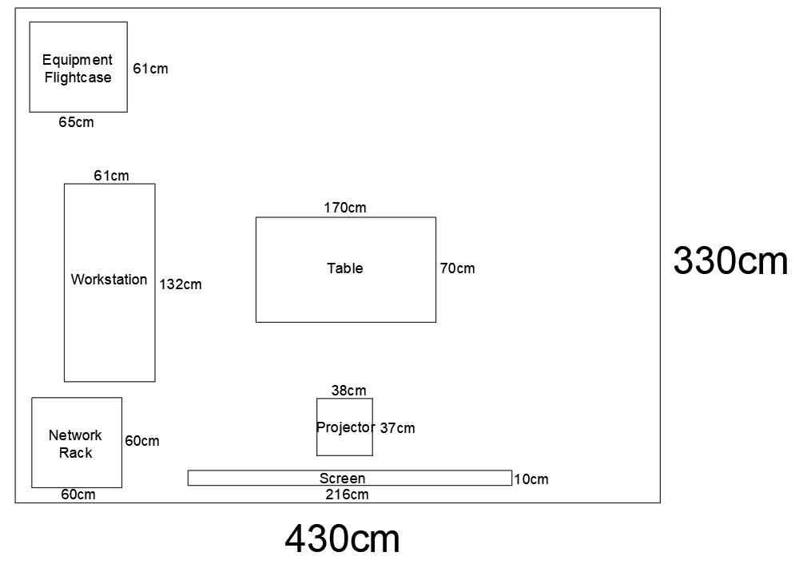
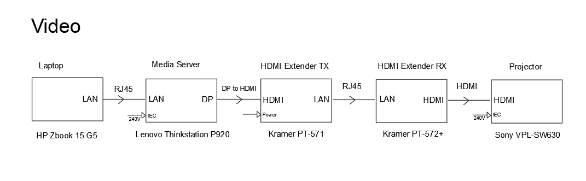
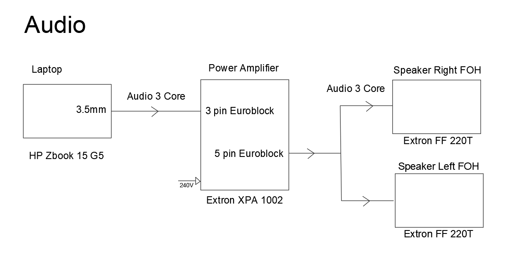

# EGL314-TeamA-ProjectSpace
*Scrum link : https://docs.google.com/spreadsheets/d/1Y40r6qJjn5tQYjjeAGe3VWtMS32XYPxb/edit#gid=1207868931*

*Slides link : https://docs.google.com/presentation/d/1O2Y1NUDbdvvYAoqxe3N-KlBIkQF81HuC/edit*

*Written Report Link : https://docs.google.com/document/d/1O2XtJwMNwenmRVS2893oCQq5SGyDaGZ7/edit*

## Team composition and roles:
- Team Lead : Yi Shan
- Asst Team Lead : Choon Kee
- Video : Yi Mon
- Programming : Thinesh & Aloysius

## Storyboard

## Rack
Our Rack consists of 3 layers;

At the top, we have an amplifier that is unused;

In the middle, we have placed a router, amplifier, and HDMI Extenders;

The bottom layer is unused.

## Floor Plan

## Cable Plan

# System Diagrams
## Video

## Audio

## Game Ideas
Reference links : 
- https://www.youtube.com/watch?v=3QKiK4rJIB0
- https://www.create-learn.us/blog/easy-games-to-code/